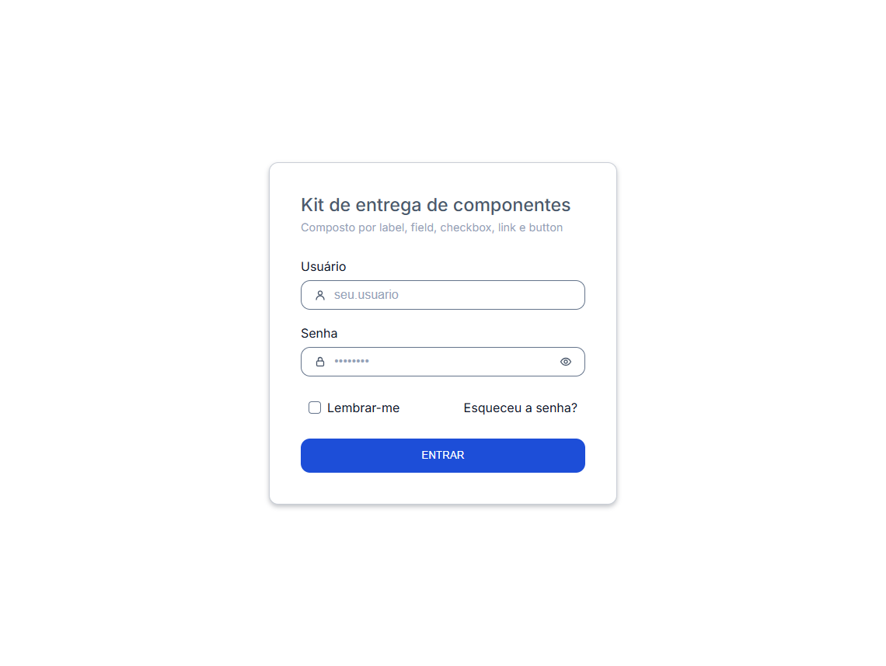
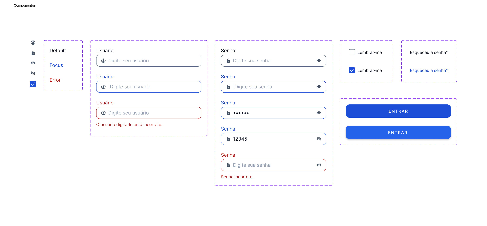

# Kit-de-Entrega-de-Componente
Entrega final para o curso de Design Systems para Inteligência Artificial da Starter

HTML/CSS puro, sem build • basta abrir o [index.html](index.html) no navegador.

Documentação: `tokens.md`, `guidelines.md`, `label.md` + `input.md` (par obrigatório) e `outros-componentes.md` (Checkbox, Link, Button, Icons).

## Preview via vercel :
[Clique aqui ou na imagem](https://kit-de-entrega-de-componente.vercel.app/){:target="_blank"}

{:target="_blank"}

## Componentes criados no figma :
[Clique aqui pou na imagem](https://www.figma.com/design/K6FxKHcEwYr8enuNeA08dI/Kit-de-entrega-de-componentes?node-id=0-1&t=zyfqDL4vaf1rpPy5-1){:target="_blank"}

{:target="_blank"}

____________________________________________

#### Por: Ana Priscilla F. conecte-se comigo no 
